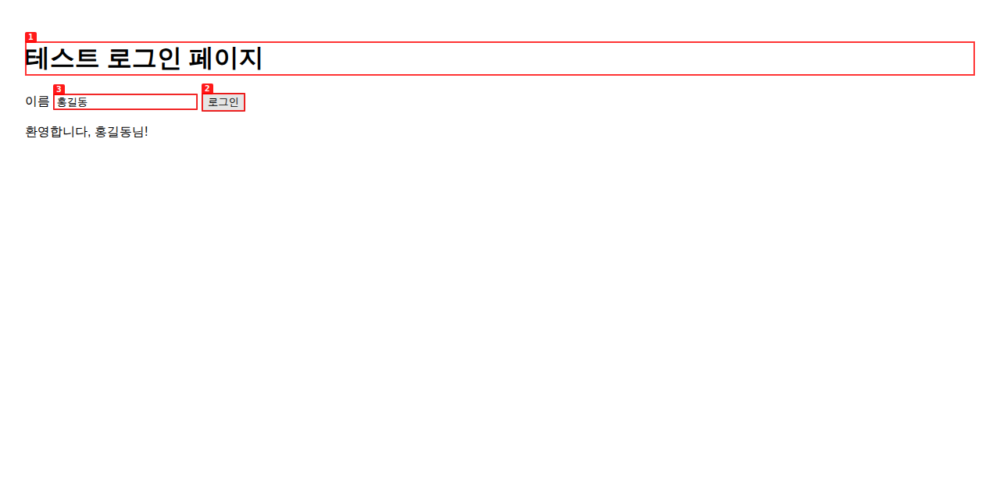

# agent-browser 완전 가이드 (초보자용)

> **한 줄 요약**
> agent-browser는 **Vercel Labs가 만든 무료(Apache-2.0) 브라우저 자동화 도구**입니다. AI 코딩 에이전트(Claude Code, Cursor, Codex 등)가 **터미널 명령으로 Chrome을 열고, 읽고, 클릭·입력하고, 캡처하고, 녹화**하게 해 줍니다.
> Windows PowerShell에서 아래 세 줄로 설치하고, Claude Code에 "agent-browser로 localhost:3000 열어서 로그인 테스트하고 스크린샷 찍어줘"라고 말하면 됩니다.
>
> ```powershell
> npm install -g agent-browser
> agent-browser install
> npx skills add vercel-labs/agent-browser
> ```

- 공식 GitHub: <https://github.com/vercel-labs/agent-browser>
- 공식 문서 사이트: <https://agent-browser.dev> (README에 링크된 주소)
- npm 패키지: <https://www.npmjs.com/package/agent-browser>
- 이 문서 기준 버전: **v0.38.2** (main 브랜치 커밋 `f7c8b07`, 2026-10-06)
- 작성일: 2026-10-07
- 같은 저장소의 다른 가이드: [chrome-devtools-mcp-guide.md](chrome-devtools-mcp-guide.md) (Google의 Chrome DevTools MCP)

---

## 목차

0. [이 문서를 어떻게 검증했나](#0-이-문서를-어떻게-검증했나)
1. [무엇인가](#1-무엇인가)
2. [동작 원리](#2-동작-원리)
3. [Chrome DevTools MCP와 비교](#3-chrome-devtools-mcp와-비교)
4. [설치 전 준비물](#4-설치-전-준비물)
5. [설치하기](#5-설치하기)
6. [설치 확인과 첫 사용](#6-설치-확인과-첫-사용)
7. [사용법 1: AI에게 말로 시키기](#7-사용법-1-ai에게-말로-시키기)
8. [사용법 2: 명령어 직접 쓰기](#8-사용법-2-명령어-직접-쓰기)
9. [응용: 실전 시나리오](#9-응용-실전-시나리오)
10. [응용: 로그인 유지와 세션](#10-응용-로그인-유지와-세션)
11. [응용: 보안 설정](#11-응용-보안-설정)
12. [응용: 설정 파일](#12-응용-설정-파일)
13. [응용: MCP 서버로 쓰기](#13-응용-mcp-서버로-쓰기)
14. [업데이트하기](#14-업데이트하기)
15. [삭제하기](#15-삭제하기)
16. [문제 해결](#16-문제-해결)
17. [토큰 비용](#17-토큰-비용)
18. [자주 묻는 질문](#18-자주-묻는-질문)
19. [출처](#19-출처)

---

## 0. 이 문서를 어떻게 검증했나

| 대상 | 확인 방법 | 결과 |
|---|---|---|
| GitHub 저장소 | `git clone` 후 README(약 2,000줄), 공식 문서 폴더(`docs/content`)의 설치·설정·스킬 문서, 번들 스킬, Claude 플러그인 매니페스트, 일부 Rust 소스 확인 | ✅ |
| 실제 동작 | npm에서 v0.38.2를 설치하고 **실제 Chromium으로** 아래를 실행 | ✅ 모두 성공 |
| └ 기본 조작 | 열기 → 스냅샷 → 입력 → 클릭 → 글자 대기 → 스크린샷 → 주석 스크린샷 | ✅ |
| └ 디버깅 | 콘솔, 네트워크 요청, Web Vitals, axe 접근성 검사 | ✅ |
| └ 응용 | 동영상 녹화(커서 표시), PDF 저장, 스냅샷 비교, API 응답 가짜로 바꾸기, 상태 저장, 일괄 실행, 세션 분리, 로그인 보관함 저장·목록·삭제 | ✅ |
| └ 진단 | `agent-browser doctor` | ✅ |
| Claude Code 연동 | `npx skills add`로 스킬 설치·삭제, **GitHub에서 바로 플러그인 설치**·`details`·삭제 | ✅ |
| MCP 모드 | MCP 클라이언트로 도구 목록과 크기 측정 (core 29개, all 156개) | ✅ |
| `agent-browser install` (Chrome 다운로드) | 작업 환경 네트워크 정책이 다운로드 사이트를 막아 **실패**. 이미 설치된 Chromium을 자동으로 찾아서 이후 테스트는 진행 | ⚠️ 여러분 PC에서는 정상일 가능성 높음 |
| 외부 사이트, Windows | 작업 환경 제약으로 **로컬 테스트 페이지, Linux에서만** 시험. Windows 내용은 공식 문서 기준 | ⚠️ |

---

## 1. 무엇인가

### 1.1 쉬운 설명

AI에게 **"브라우저 리모컨"** 을 쥐여 주는 도구입니다. 사람이 마우스로 하는 일을 짧은 명령어로 바꿔 줍니다.

```
agent-browser open example.com     ← 사이트 열기
agent-browser snapshot -i          ← 화면에 뭐가 있는지 목록으로 보기
agent-browser click @e2            ← 2번 요소 클릭
agent-browser fill @e3 "홍길동"     ← 3번 입력칸에 글자 넣기
agent-browser screenshot shot.png  ← 화면 캡처
```

AI(Claude)는 이 명령어를 **터미널에서 대신 실행**하면서 웹사이트를 조작합니다. 사람이 직접 쳐도 똑같이 동작합니다.

### 1.2 누가 만들었나

- **Vercel Labs**가 만들었습니다. Vercel은 Next.js를 만든 회사이고, Labs는 실험적 제품 부서입니다.
- 라이선스는 **Apache-2.0** 오픈소스입니다.
- npm 패키지 관리자에 Vercel 배포 계정(`vercel-release-bot`)이 포함되어 있습니다.
- Claude 플러그인 매니페스트의 소유자도 "Vercel (support@vercel.com)"입니다.

### 1.3 특징

| 특징 | 설명 |
|---|---|
| **빠름** | Rust로 만든 네이티브 프로그램입니다. 첫 실행 이후 브라우저가 백그라운드에 떠 있어서 명령이 즉시 실행됩니다 (테스트에서 첫 열기 약 2초) |
| **명령어 중심** | MCP 서버가 아니라 **명령줄 도구(CLI)** 가 기본입니다. AI가 터미널 명령으로 쓰는 것이 공식 추천 방식입니다 |
| **AI 친화적 출력** | 페이지를 `@e1`, `@e2` 같은 짧은 번호로 요약해서 토큰을 아낍니다 |
| **최신 설명서 자동 제공** | 사용법이 프로그램 안에 들어 있어서(`agent-browser skills get core`) 버전이 바뀌어도 설명서가 맞습니다 |
| **로그인과 보안 기능** | 암호화된 로그인 보관함, 상태 저장·복원, 도메인 제한, 위험 동작 승인 |
| **폭넓은 대상** | Chrome 외에 Lightpanda, Obscura 엔진, iOS 시뮬레이터 Safari, Electron 앱(Slack, VS Code 등), 클라우드 브라우저 서비스 |

---

## 2. 동작 원리

```
 ┌──────────┐ "로그인 테스트해줘" ┌──────────────────┐
 │ 사용자    │ ─────────────────► │ Claude (AI)       │
 └──────────┘                    │ ① 스킬을 읽고       │
                                 │ ② 터미널 명령 실행   │
                                 └────────┬─────────┘
                       agent-browser click @e2  (Bash 도구)
                                          ▼
                                 ┌──────────────────┐
                                 │ agent-browser CLI │ ← Rust 실행 파일
                                 └────────┬─────────┘
                                          ▼ (백그라운드에서 계속 실행)
                                 ┌──────────────────┐
                                 │ 데몬 (daemon)      │ ← 브라우저를 붙잡고 있는
                                 └────────┬─────────┘    관리 프로그램
                                          ▼ Chrome DevTools Protocol (CDP)
                                 ┌──────────────────┐
                                 │ Chrome            │
                                 └──────────────────┘
```

- **첫 명령**을 실행하면 데몬과 Chrome이 자동으로 뜹니다. 이후 명령은 같은 브라우저를 계속 씁니다.
- 데몬은 **1시간 동안 명령이 없으면** 스스로 종료합니다 (`--idle-timeout`으로 변경 가능, `0`이면 끄지 않음). 화면이 보이는 모드(`--headed`)의 브라우저나 내가 연결한 브라우저는 자동으로 닫지 않습니다.
- 데몬 실행에는 **Node.js가 필요 없습니다.** npm은 설치할 때만 씁니다.
- Windows에서는 창 없는(headless) Chrome이 **별도의 보이지 않는 데스크톱**에서 실행됩니다. 화면에 보려면 `--headed`를 붙이세요.

### AI가 페이지를 보는 방법

`snapshot -i`는 클릭하거나 입력할 수 있는 요소만 번호를 붙여 보여 줍니다. 테스트에서 실제로 받은 결과입니다.
```
- heading "테스트 로그인 페이지" [level=1, ref=e1]
- textbox "이름 " [ref=e3]
- button "로그인" [ref=e2]
```
`screenshot --annotate`로 찍으면 같은 번호가 이미지 위에 표시됩니다. AI가 화면을 이미지로도 확인할 수 있습니다.



---

## 3. Chrome DevTools MCP와 비교

| 항목 | agent-browser | Chrome DevTools MCP |
|---|---|---|
| 만든 곳 | Vercel Labs | Google Chrome DevTools 팀 |
| 기본 형태 | **CLI** (MCP는 선택) | **MCP 서버** (CLI는 실험 기능) |
| 잘하는 것 | **자동화**: 조작, 로그인 유지, 세션, 녹화, API 모킹, 일괄 실행, 보안 제한 | **분석**: 성능 기록과 원인 분석, Lighthouse, 메모리 힙 분석, CSS 상세 |
| 성능 측정 | `vitals` (LCP, FCP, TTFB, CLS, INP 수치) | 성능 기록 + 원인 분석 (LCP 구간별 분해) |
| 접근성 | axe-core 검사 | Lighthouse 검사 |
| 상시 토큰 (Claude Code) | 스킬 방식 약 230~340 | 도구 30개 약 6,400 (추정) |
| 기본 데이터 전송 | README와 소스 검색에서 사용 통계 수집을 찾지 못함 (전체 감사는 아님) | Google 사용 통계 기본 켜짐, 성능 측정 시 URL을 CrUX로 전송 (끌 수 있음) |

**추천:** 브라우저를 열고 조작하고 캡처하는 일반 용도에는 agent-browser, 성능·Lighthouse·메모리 분석에는 Chrome DevTools MCP가 맞습니다. 둘 다 설치했다면 18장의 주의사항을 보세요.

---

## 4. 설치 전 준비물

| 준비물 | 필요한 경우 | 확인 |
|---|---|---|
| Node.js + npm | npm으로 설치할 때 (권장 방법) | `node --version`, `npm --version` |
| Chrome | 자동화 대상 브라우저 | `agent-browser install`이 자동으로 받아 줌 |
| Claude Code | AI와 함께 쓸 때 | `claude --version` |
| ffmpeg | **동영상 녹화**를 쓸 때만 | `ffmpeg -version` |

- 소스에서 직접 빌드할 때만 Node.js 24 이상, pnpm 11 이상, Rust가 필요합니다. 일반 설치에는 필요 없습니다 (테스트는 Node.js 22로 성공).
- 이미 설치된 Chrome, Brave, Playwright, Puppeteer 브라우저를 **자동으로 찾아서** 씁니다.

---

## 5. 설치하기

설치는 두 단계입니다.
1. **본체 설치:** agent-browser 프로그램과 Chrome
2. **AI 연결:** Claude Code가 agent-browser를 알게 하기 (스킬 또는 플러그인)

### 5.1 본체 설치 (필수)

Windows PowerShell(또는 macOS·Linux 터미널)에서 실행합니다.
```powershell
npm install -g agent-browser    # 프로그램 설치 (Windows x64용 실행 파일 포함)
agent-browser install           # Chrome for Testing 다운로드 (처음 한 번)
agent-browser --version         # 확인 → agent-browser 0.38.2
```

| 다른 설치 방법 | 명령 |
|---|---|
| 설치 없이 바로 써 보기 | `npx agent-browser install` 후 `npx agent-browser open example.com` |
| 프로젝트에만 설치 (버전 고정) | `npm install agent-browser` 후 `npx agent-browser install` |
| macOS Homebrew | `brew install agent-browser` |
| Rust Cargo | `cargo install agent-browser` (빌드에 2~3분) |
| Linux 시스템 라이브러리 | `agent-browser install --with-deps` |

### 5.2 Claude Code와 연결 (택 1)

| 방법 | 명령 | 특징 |
|---|---|---|
| **A. 스킬 설치 (공식 추천)** | `npx skills add vercel-labs/agent-browser` | 여러 AI 도구(Claude Code, Codex, Cursor, Gemini CLI, Copilot 등)에 설치 가능 |
| **B. Claude Code 플러그인** | `/plugin marketplace add vercel-labs/agent-browser`<br>`/plugin install agent-browser@agent-browser` | Claude Code 플러그인 관리 화면에서 켜고 끄기 편함 |

**두 방법 모두 들어가는 것은 같습니다.** 짧은 안내 스킬 하나이고, 실제 사용법은 프로그램이 제공합니다. **둘 중 하나만** 하세요.

> ⚠️ 스킬이나 플러그인만 설치하면 **본체(5.1)가 없어서 동작하지 않습니다.** 반드시 5.1을 먼저 하세요.

#### 방법 A. 스킬 설치 (실제 실행 확인)

```powershell
cd 내프로젝트폴더
npx skills add vercel-labs/agent-browser
```
- 설치할 AI 도구를 묻는 화면이 나오면 **Claude Code**를 선택합니다.
- 여러 도구를 고르면 "Symlink / Copy" 질문이 나옵니다. 보통 **Symlink**를 고르면 됩니다 (Windows에서 링크 만들기가 막히면 Copy).
- 결과: `.claude/skills/agent-browser/SKILL.md`가 생깁니다.
- 모든 프로젝트에서 쓰려면 `-g`를 붙입니다: `npx skills add vercel-labs/agent-browser -g`

#### 방법 B. 플러그인 설치 (실제 실행 확인)

Claude Code 안에서:
```
/plugin marketplace add vercel-labs/agent-browser
/plugin install agent-browser@agent-browser
```
터미널 명령으로도 됩니다.
```powershell
claude plugin marketplace add vercel-labs/agent-browser
claude plugin install agent-browser@agent-browser
```
실제 실행 결과:
```
√ Successfully added marketplace: agent-browser
√ Successfully installed plugin: agent-browser@agent-browser (scope: user)
Component inventory: Skills (1) agent-browser / Hooks (0) / MCP servers (0)
Always-on: ~336 tok
```
설치 후 Claude Code를 재시작하세요.

#### 데스크톱 앱 Code 탭에서

Claude Code 공식 문서에 따르면 데스크톱 앱 Code 탭은 터미널 Claude Code와 **스킬·플러그인 설정을 공유**합니다. 위 방법으로 설치했다면 Code 탭에서도 쓸 수 있습니다. 화면에서 설치하려면 입력창 옆 **+ → Plugins → Add plugin**을 씁니다. 목록에 없으면 내장 터미널(`` Ctrl+` ``)에서 방법 B의 마켓 등록 명령을 한 번 실행하세요. 실행 환경은 **Local** 세션을 쓰세요. (데스크톱 앱에서 직접 시험하지는 않았습니다.)

---

## 6. 설치 확인과 첫 사용

### 6.1 진단 도구로 확인 (실제 실행 확인)

```powershell
agent-browser doctor
```
실제 결과 예시 (빠른 오프라인 모드 `doctor --offline --quick`):
```
Environment
  pass  CLI version 0.38.2
  pass  State and socket directory /root/.agent-browser
Chrome
  pass  Chromium 141.0.7390.37 at ...
Recording
  pass  ffmpeg version 6.1.1 ...
Daemons
  pass  No active daemons
Summary: 8 pass, 0 warn, 0 fail
```
문제가 있으면 `agent-browser doctor --fix`가 고칠 수 있는 것을 고쳐 줍니다 (Chrome 재설치, 버전이 안 맞는 데몬 종료 등).

### 6.2 손으로 한 번 해 보기

```powershell
agent-browser --headed open https://example.com   # --headed: 창을 보이게
agent-browser snapshot -i
agent-browser screenshot first.png
agent-browser close
```
Chrome 창이 뜨고 `first.png`가 생기면 성공입니다.

### 6.3 AI로 해 보기

Claude Code에서:
```
agent-browser로 https://example.com 열어서 제목 읽고 스크린샷 찍어줘
```
Claude가 `agent-browser skills get core`로 사용법을 읽은 뒤 명령을 실행하면 정상입니다. 처음에 **명령 실행 권한**을 물으면 허용하세요.

---

## 7. 사용법 1: AI에게 말로 시키기

명령어를 몰라도 됩니다. "agent-browser로"를 앞에 붙이면 확실하게 이 도구를 씁니다.

| 하고 싶은 일 | 이렇게 말하기 |
|---|---|
| 사이트 열기·캡처 | "agent-browser로 localhost:3000 열어서 전체 페이지 스크린샷 찍어줘" |
| 클릭·입력 | "이메일에 test@example.com, 비밀번호에 test1234 넣고 로그인 눌러줘" |
| 폼 테스트 | "회원가입 폼을 이상한 값(빈칸, 너무 긴 글, 특수문자)으로 채워서 에러 메시지가 제대로 나오는지 봐줘" |
| 내용 추출 | "이 페이지 상품 목록의 이름과 가격을 표로 정리해줘" |
| 에러 확인 | "콘솔 에러랑 실패한 네트워크 요청 있는지 확인해줘" |
| 녹화 | "로그인부터 글쓰기까지 하는 과정을 커서 보이게 동영상으로 녹화해줘" |
| 화면 크기 | "아이폰 14 크기로 바꿔서 메뉴가 잘 보이는지 캡처해줘" |
| 다크모드 | "다크모드로 바꿔서 글자가 잘 보이는지 확인해줘" |
| 접근성 | "접근성 검사 돌려서 심각한 문제부터 알려줘" |
| 속도 | "Core Web Vitals 측정해줘" |
| PDF 저장 | "이 페이지를 PDF로 저장해줘" |
| 탐색형 테스트 | "agent-browser dogfood 스킬로 우리 앱을 사용자처럼 돌아다니면서 버그 찾아서 보고서 써줘" |

### 프로그램이 제공하는 추가 스킬

Claude가 필요하면 `agent-browser skills get <이름>`으로 읽습니다. 이름을 직접 말해도 됩니다.

| 스킬 | 용도 |
|---|---|
| `core` | 기본 사용법 (가장 먼저 읽힘) |
| `dogfood` | 사용자처럼 앱을 돌아다니며 버그·UX 문제 찾고 스크린샷·재현 영상이 담긴 보고서 작성 |
| `derive-client` | 사이트의 네트워크를 기록해서 내부 API를 찾아내고, 브라우저 없이 쓰는 클라이언트 코드 생성 |
| `electron` | Electron 앱 자동화 (VS Code, Slack, Discord, Figma, Notion 등) |
| `slack` | Slack 안 읽은 메시지 확인, 검색, 메시지 보내기 |
| `vercel-sandbox`, `protected-vercel-deployments`, `agentcore` | Vercel·AWS 클라우드 환경용 |
| `webmcp-gen` | 실험적 WebMCP 도구 만들기 |

> ⚠️ `derive-client`나 데이터 추출 기능을 남의 사이트에 쓸 때는 이용약관, robots.txt, 관련 법을 지키세요. Slack 등 회사 계정 자동화는 회사 정책을 먼저 확인하세요.

---

## 8. 사용법 2: 명령어 직접 쓰기

AI 없이 직접 쓰거나, AI가 무엇을 하는지 이해할 때 참고하세요.

### 8.1 기본 흐름

```powershell
agent-browser open http://localhost:3000     # 1. 열기
agent-browser snapshot -i                    # 2. 요소 번호 확인
agent-browser fill @e3 "홍길동"               # 3. 조작 (번호 사용)
agent-browser click @e2
agent-browser wait --text "환영합니다"         # 4. 결과 기다리기
agent-browser screenshot result.png          # 5. 캡처
agent-browser close                          # 6. 닫기
```
페이지가 바뀌면 번호도 바뀌므로 **다시 `snapshot -i`** 를 실행해야 합니다.

### 8.2 자주 쓰는 명령

| 분류 | 명령 | 설명 |
|---|---|---|
| 이동 | `open <url>`, `back`, `forward`, `reload` | 열기, 뒤로, 앞으로, 새로고침 |
| 읽기 | `snapshot -i` / `snapshot` | 조작 가능한 요소만 / 전체 구조 |
| | `read [url]` | AI가 읽기 좋은 본문 텍스트 |
| | `get text @e1`, `get url`, `get title`, `get html`, `get value` | 값 가져오기 |
| | `is visible @e1`, `is enabled`, `is checked` | 상태 확인 |
| 조작 | `click`, `dblclick`, `fill`, `type`, `press Enter`, `hover`, `check`, `uncheck`, `select`, `drag`, `upload`, `scroll down 500` | 마우스·키보드 |
| | `find role button click --name "Submit"` | 번호 대신 역할이나 글자로 찾아 조작 |
| | `click "#submit"` | CSS 선택자도 가능 |
| 기다리기 | `wait @e1`, `wait 1000`, `wait --text "완료"` | 요소, 시간(ms), 글자 |
| 캡처 | `screenshot [파일]`, `screenshot --full`, `screenshot --annotate` | 화면, 전체 페이지, 번호 표시 |
| | `pdf <파일>` | PDF 저장 |
| | `record start <파일.webm> --cursor` / `record stop` | 동영상 녹화 (**ffmpeg 필요**) |
| 디버깅 | `console`, `errors` | 콘솔 로그, 스크립트 에러 |
| | `network requests` | 네트워크 요청 목록 |
| | `vitals` | LCP, FCP, TTFB, CLS, INP |
| | `a11y` | axe-core 접근성 검사 |
| | `trace start` / `trace stop`, `profiler start` / `profiler stop` | Chrome 성능 기록 파일 |
| | `inspect` | 사람이 볼 수 있게 Chrome DevTools 열기 |
| 환경 | `set viewport 375 812`, `set device "iPhone 14"`, `set media dark`, `set offline on`, `set geo 37.56 126.97` | 화면 크기, 기기, 다크모드, 오프라인, 위치 |
| 탭 | `tab list`, `tab new`, `tab 2`, `tab close` | 탭 관리 |
| 비교 | `diff snapshot`, `diff screenshot --baseline <이미지>`, `diff url <u1> <u2>` | 변경 전후 비교 |
| 일괄 | `batch "get title" "get url"` | 여러 명령을 한 번에 |
| JS | `eval "document.title"` | 페이지에서 JavaScript 실행 |
| 도움말 | `--help`, `skills get core --full` | 전체 명령 설명 |

### 8.3 실제 테스트 출력 예시

```
$ agent-browser console
[error] demo error: 일부러 낸 콘솔 에러

$ agent-browser network requests
GET http://localhost:8765/ (Document) 200
GET http://localhost:8765/favicon.ico (Other) 404
GET http://localhost:8765/api.json (Fetch) 200

$ agent-browser vitals
ttfb: 3ms  fcp: 32ms  lcp: 32ms  cls: 0  inp: -
lcp: element: h1

$ agent-browser a11y
axe-core: 4.12.1  violations: 2  incomplete: 0  passes: 15
[moderate] landmark-one-main: Document should have one main landmark (1 node)
[moderate] region: All page content should be contained by landmarks (2 nodes)
```

### 8.4 자주 쓰는 옵션

| 옵션 | 효과 |
|---|---|
| `--headed` | 브라우저 창을 화면에 보이기 (기본은 창 없음) |
| `--session <이름>` | 서로 다른 브라우저를 따로 띄우기 (10장) |
| `--profile <경로나 이름>` | 프로필 지정 (10장) |
| `--json` | 결과를 JSON으로 (스크립트용) |
| `--executable-path <경로>` | 특정 Chrome 실행 파일 사용 |
| `--engine lightpanda` | 다른 브라우저 엔진 사용 |
| `--ignore-https-errors` | 로컬 HTTPS 인증서 오류 무시 (**주의해서 사용**) |
| `--idle-timeout 10m` | 자동 종료 시간 변경 |

---

## 9. 응용: 실전 시나리오

### 시나리오 1. 내가 만든 웹앱 자동 점검

```
npm run dev 띄우고 agent-browser로 localhost:5173을 열어서
회원가입 → 로그인 → 글쓰기 → 로그아웃을 직접 해 봐.
단계마다 --annotate 스크린샷을 screenshots 폴더에 남기고,
콘솔 에러와 실패한 요청이 있으면 원인을 고친 다음 같은 흐름을 다시 돌려서 확인해줘.
```

### 시나리오 2. 버그 재현 영상 만들기

```
agent-browser로 장바구니에서 수량을 0으로 바꾸면 총액이 NaN이 되는 버그를 재현하고,
--cursor 옵션으로 녹화해서 bug.webm으로 저장해줘.
```

### 시나리오 3. 백엔드 없이 화면 테스트 (API 모킹)

API 응답을 가짜로 바꿔서 에러 화면이나 빈 목록 화면을 확인합니다.
```powershell
agent-browser open http://localhost:3000
agent-browser network route "**/api/items" --body '[]'      # 빈 목록 응답으로 바꾸기
agent-browser reload
agent-browser screenshot empty-state.png
agent-browser network unroute                                # 원래대로
```
(테스트에서 `/api.json` 응답이 `{"ok":false,"mocked":true}`로 바뀌는 것을 확인했습니다.)

### 시나리오 4. 디자인 변경 전후 비교

```powershell
agent-browser open http://localhost:3000
agent-browser screenshot before.png
# ... 코드 수정 ...
agent-browser reload
agent-browser diff screenshot --baseline before.png
```

### 시나리오 5. 반응형·다크모드 점검

```
agent-browser로 메인 페이지를 iPhone 14, iPad, 1440x900 세 가지 크기와
다크모드에서 각각 캡처하고, 레이아웃이 깨지는 곳을 정리해줘.
```

### 시나리오 6. 탐색형 QA

```
agent-browser dogfood 스킬로 localhost:3000을 처음 온 사용자처럼 20분 정도 써 보고,
버그와 불편한 점을 스크린샷이 담긴 보고서로 만들어줘.
```

### 시나리오 7. React 앱 분석 (React 개발자용)

```powershell
agent-browser open --enable react-devtools http://localhost:3000
agent-browser react tree                 # 컴포넌트 트리
agent-browser react renders start        # 리렌더링 기록 시작
# ... 화면 조작 ...
agent-browser react renders stop         # 어떤 컴포넌트가 몇 번 렌더링됐는지
```

### 시나리오 8. 반복 업무 자동화

```
매주 하는 일: 사내 관리자 페이지에 로그인해서 지난주 주문 내역 표를 CSV로 정리.
agent-browser로 한 번 해 보고, 다음에도 쓸 수 있게 명령어를 셸 스크립트로 저장해줘.
```

---

## 10. 응용: 로그인 유지와 세션

로그인이 필요한 사이트를 매번 다시 로그인하지 않는 방법입니다.

| 방법 | 언제 | 명령 |
|---|---|---|
| **내 Chrome 프로필 재사용** | 평소 Chrome에 로그인된 상태 그대로 쓰고 싶을 때 | `agent-browser profiles` (목록)<br>`agent-browser --profile Default open https://gmail.com` |
| **전용 프로필 폴더** | 자동화용 프로필에 한 번 로그인하고 계속 쓰기 | `agent-browser --profile ~/.myapp-profile open myapp.com` |
| **상태 파일** | 로그인 상태(쿠키 등)를 파일로 저장하고 불러오기 | `agent-browser state save my-auth.json`<br>`agent-browser --state my-auth.json open ...` |
| **세션 자동 저장** | 같은 이름의 세션을 쓸 때마다 자동 저장·복원 | `agent-browser --session myapp --restore open ...` |
| **로그인 보관함** | 아이디·비밀번호를 암호화해 저장하고 이름으로 로그인. **AI가 비밀번호를 보지 못함** | 아래 참고 |

### 로그인 보관함 (Auth Vault) (저장·목록·삭제 실제 실행 확인)

```powershell
# 비밀번호를 화면이나 명령 기록에 남기지 않고 저장 (표준 입력으로 전달)
Read-Host -AsSecureString "비밀번호" | ConvertFrom-SecureString -AsPlainText | agent-browser auth save mysite --url https://mysite.com/login --username myid --password-stdin

agent-browser auth login mysite     # 저장된 정보로 로그인 폼 자동 입력·제출
agent-browser auth list             # 저장 목록
agent-browser auth delete mysite    # 삭제
```
- 위 PowerShell 한 줄은 PowerShell 7 기준 예시입니다 (`-AsPlainText`는 PowerShell 7 이상). macOS·Linux에서는 `read -s PW; echo "$PW" | agent-browser auth save ...`처럼 씁니다.
- 암호화 키는 처음 저장할 때 `~/.agent-browser/.encryption-key`에 자동 생성됩니다. 환경변수 `AGENT_BROWSER_ENCRYPTION_KEY`로 직접 지정할 수도 있습니다.
- Claude에게는 "mysite 보관함으로 로그인해줘"라고 하면 됩니다. 비밀번호를 대화에 쓰지 마세요.

### 주의사항

> 🚨 **상태 파일(`state save`)에는 로그인 토큰이 평문으로 들어 있습니다.** `.gitignore`에 추가하고, 다 쓰면 지우세요. 암호화하려면 `AGENT_BROWSER_ENCRYPTION_KEY`를 설정하세요 (공식 README).
> 🚨 **내 Chrome 프로필 재사용**은 그 프로필에 로그인된 모든 사이트(메일, 은행 등)를 AI가 쓸 수 있게 됩니다. 원본 프로필은 임시 폴더로 **복사**해서 쓰므로 원본은 바뀌지 않습니다. 가능하면 자동화 전용 프로필을 쓰세요.
> 💡 Windows에서 `--profile <이름>`을 쓸 때는 Chrome을 먼저 닫으세요. 프로필 파일이 잠겨 있을 수 있습니다.

### 세션: 브라우저를 여러 개 따로 쓰기 (실제 실행 확인)

```powershell
agent-browser --session work open https://site-a.com
agent-browser --session test open http://localhost:3000
agent-browser session list        # → default, work, test
agent-browser close --all         # 모든 세션 닫기
```
세션마다 브라우저, 쿠키, 방문 기록, 로그인 상태가 따로입니다.

---

## 11. 응용: 보안 설정

공식 README 기준으로 보안 기능은 모두 **기본으로 꺼져 있고, 켜야 동작**합니다. AI에게 모르는 사이트를 맡길 때 특히 유용합니다.

| 기능 | 옵션 | 효과 |
|---|---|---|
| **도메인 제한** | `--allowed-domains "example.com,*.example.com"` | 허용한 도메인 외에는 페이지 이동, 이미지·스크립트 요청, WebSocket까지 차단. WebRTC도 꺼짐. 단, 내 Chrome 프로필이나 자동 연결과는 함께 쓸 수 없음 |
| **콘텐츠 경계 표시** | `--content-boundaries` | 웹페이지 내용을 경계 표시로 감싸서, 페이지 속 "AI야 이걸 실행해" 같은 문구를 AI가 지시로 착각하지 않도록 도움 |
| **위험 동작 승인** | `--confirm-actions eval,download` | 지정한 종류의 동작 전에 승인 요구 (`confirm <id>` / `deny <id>`) |
| **동작 정책 파일** | `--action-policy ./policy.json` | 허용·금지할 동작을 파일로 정함 |
| **출력 길이 제한** | `--max-output 50000` | 페이지 내용이 너무 길어서 AI 컨텍스트가 넘치는 것 방지 |
| **로그인 보관함** | `auth save` / `auth login` | 비밀번호를 AI에게 보여주지 않음 (10장) |

**안전한 기본 설정 예시** (`~/.agent-browser/config.json`, 12장):
```json
{
  "contentBoundaries": true,
  "maxOutput": 50000,
  "confirmActions": "eval,download"
}
```

> ⚠️ `--cdp`나 `--auto-connect`로 디버깅 포트를 연 Chrome에 연결하면, 그동안 **내 PC의 어떤 프로그램이든** 그 Chrome을 조종할 수 있습니다. 믿을 수 있는 PC에서만 쓰고, 끝나면 그 Chrome을 닫으세요 (공식 README).

---

## 12. 응용: 설정 파일

매번 옵션을 붙이기 귀찮으면 설정 파일에 적어 둡니다.

| 우선순위 | 위치 | 범위 |
|---|---|---|
| 1 (가장 낮음) | `~/.agent-browser/config.json` (Windows: `%USERPROFILE%\.agent-browser\config.json`) | 내 모든 작업 |
| 2 | 프로젝트 폴더의 `agent-browser.json` | 이 프로젝트 |
| 3 | `AGENT_BROWSER_*` 환경변수 | 위 둘을 덮어씀 |
| 4 (가장 높음) | 명령 옵션 | 모두 덮어씀 |

키 이름은 옵션 이름을 camelCase로 바꾼 것입니다 (`--ignore-https-errors` → `ignoreHttpsErrors`). 파일 맨 위에 `$schema`를 넣으면 VS Code 등에서 자동 완성이 됩니다.
```json
{
  "$schema": "https://agent-browser.dev/schema.json",
  "headed": true,
  "colorScheme": "dark",
  "screenshotDir": "./screenshots",
  "idleTimeout": "15m"
}
```
설정 파일 문법이 맞는지는 `agent-browser doctor`가 검사해 줍니다.

---

## 13. 응용: MCP 서버로 쓰기

agent-browser는 **MCP 서버로도** 실행할 수 있습니다. 다만 Claude Code에서는 **스킬 방식이 훨씬 가볍습니다** (17장). 터미널 명령을 실행할 수 없는 AI 도구에서 쓸 때 고려하세요.

```powershell
claude mcp add agent-browser --scope user -- agent-browser mcp
```
일반 MCP 설정 파일 형식:
```json
{
  "mcpServers": {
    "agent-browser": {
      "command": "agent-browser",
      "args": ["mcp"]
    }
  }
}
```

| 도구 묶음 | 옵션 | 도구 수 (실측) |
|---|---|---|
| `core` (기본) | 없음 | 29개, 약 15,900토큰 |
| 전체 | `--tools all` | 156개, 약 82,000토큰 |
| 조합 | `--tools core,network,react` | 필요한 것만 |

묶음 종류: `core`, `network`, `state`, `debug`, `tabs`, `react`, `mobile`, `all`

위 `claude mcp add` 명령은 일반적인 등록 형식을 적용한 것이고, 제가 Claude Code에 직접 등록해 보지는 않았습니다. MCP 클라이언트로 도구 목록을 받는 것까지는 확인했습니다.

---

## 14. 업데이트하기

| 대상 | 명령 |
|---|---|
| 본체 | `agent-browser upgrade` (npm, Homebrew, Cargo 중 설치한 방법을 자동으로 찾아 업데이트) |
| 스킬 (방법 A) | `npx skills update` |
| 플러그인 (방법 B) | `claude plugin marketplace update agent-browser` 후 `claude plugin update agent-browser@agent-browser`, 그리고 재시작 |

실제 사용법(`skills get core`)은 본체에 들어 있어서, **본체만 업데이트해도 AI가 읽는 설명서가 최신으로 바뀝니다.** 업데이트 후 `agent-browser doctor`를 한 번 실행하면 버전이 안 맞는 오래된 데몬을 정리해 줍니다.

---

## 15. 삭제하기

순서대로 하면 깔끔하게 지워집니다.

### 1단계. 실행 중인 브라우저 닫기

```powershell
agent-browser close --all
```
대시보드를 켰다면 함께 종료합니다 (`agent-browser dashboard stop`).

### 2단계. Claude Code 연결 해제 (설치한 방법에 맞게)

| 방법 | 삭제 명령 (실제 실행 확인) |
|---|---|
| A. 스킬 | 설치한 프로젝트 폴더에서 `npx skills remove -s agent-browser -y`. 전역(`-g`)으로 설치했다면 `-g` 추가 |
| B. 플러그인 | `claude plugin uninstall agent-browser@agent-browser`<br>`claude plugin marketplace remove agent-browser` |
| MCP로 등록했다면 | `claude mcp remove agent-browser --scope user` |

`CLAUDE.md`나 `AGENTS.md`에 사용법을 적어 두었다면 그 부분도 지우세요.

### 3단계. 본체 삭제

```powershell
npm uninstall -g agent-browser
```
Homebrew는 `brew uninstall agent-browser`, Cargo는 `cargo uninstall agent-browser`입니다.

### 4단계. 남은 데이터 삭제 (선택)

모든 데이터는 홈 폴더의 `.agent-browser`에 있습니다 (소스 코드와 doctor 출력으로 확인).

| 하위 폴더·파일 | 내용 |
|---|---|
| `browsers/` | `agent-browser install`로 받은 Chrome (용량이 큼) |
| `auth/` | 로그인 보관함 (암호화됨) |
| `.encryption-key` | 보관함 암호화 키 |
| `sessions/` | 자동 저장된 세션 상태 |
| `config.json` | 사용자 설정 |
| `tmp/` | HAR 등 임시 파일 |
| `*.sock`, `*.pid` 등 | 데몬 실행 흔적 |

```powershell
Remove-Item -Recurse -Force "$env:USERPROFILE\.agent-browser"
```
> ⚠️ 이 폴더를 지우면 **로그인 보관함과 암호화 키도 함께 사라져서** 복구할 수 없습니다. 다시 쓸 계획이면 `browsers/`만 지워서 용량을 확보하세요.

그 밖에 직접 만든 파일도 정리하세요: 프로젝트의 `agent-browser.json`, 상태 파일(`*.json`), 전용 프로필 폴더(`--profile`로 지정한 경로), 스크린샷·녹화 파일.

---

## 16. 문제 해결

| 증상 | 해결 |
|---|---|
| 무엇이 문제인지 모르겠음 | **`agent-browser doctor`부터 실행.** 오래된 데몬 파일을 자동으로 정리합니다. 고칠 수 있는 것은 `doctor --fix` |
| `agent-browser`를 찾을 수 없음 | `npm install -g` 후 터미널을 **새로 열기**. 데스크톱 앱 Code 탭이면 앱 재시작 |
| Chrome 다운로드 실패 | 회사 방화벽 등으로 `googlechromelabs.github.io` 접속이 막힌 경우. 이미 설치된 Chrome을 자동으로 찾으므로 Chrome이 설치돼 있으면 그냥 써 보세요. 또는 `--executable-path`로 Chrome 경로 지정 |
| Linux에서 브라우저가 안 뜸 | `agent-browser install --with-deps` |
| 클릭이 실패하고 "다른 요소가 가리고 있다"고 나옴 | 쿠키 동의 배너나 팝업이 가린 상태. 그것을 먼저 닫고 `snapshot -i`를 다시 한 뒤 클릭 |
| `@e2`가 다른 요소를 누름 / 없다고 나옴 | 페이지가 바뀌면 번호가 바뀝니다. `snapshot -i`를 다시 실행 |
| 창이 안 보임 | 기본은 창 없음 모드입니다. `--headed` 사용 |
| `--profile`이 안 됨 (Windows) | Chrome을 모두 닫고 다시 시도 |
| 녹화가 안 됨 | ffmpeg 설치 확인 (`doctor`의 Recording 항목) |
| 브라우저가 1시간 뒤 사라짐 | 정상입니다 (자동 종료). `--idle-timeout 0`으로 끌 수 있음 |
| AI가 다른 브라우저 도구를 씀 | "agent-browser로"를 명시 |

---

## 17. 토큰 비용

| 사용 방식 | 항상 드는 비용 | 쓸 때 추가 | 근거 |
|---|---|---|---|
| **플러그인 (방법 B)** | **약 336토큰** | 스킬 실행 시 약 850 + `skills get core` 약 9,400 (글자 수 ÷ 4 추정) | `claude plugin details` 출력 |
| **스킬 (방법 A)** | 약 230토큰 (스킬 설명 925자 ÷ 4 추정) | 위와 같음 | 실측 글자 수 |
| `skills get core --full` | — | 약 36,000토큰 (144,857자 ÷ 4 추정) | 전체 명령 참조가 필요할 때만 |
| MCP `core` | 약 15,900토큰 | 결과 출력 | 실측 |
| MCP `--tools all` | 약 82,000토큰 | 결과 출력 | 실측 |

- **Claude Code에서는 스킬이나 플러그인 방식이 가장 가볍습니다.** 설명서는 쓸 때만 불러오고, 명령 출력도 짧습니다.
- 토큰을 아끼려면 `screenshot`(이미지)보다 `snapshot -i`(텍스트)나 `get text`를 쓰고, `--max-output`으로 긴 출력을 제한하세요.

---

## 18. 자주 묻는 질문

**Q. 무료인가요?**
A. 네. Apache-2.0 오픈소스입니다. AI 서비스 토큰 비용은 별도입니다. AI 채팅 기능(`chat` 명령)은 별도 API 키가 필요하지만, Claude Code와 함께 쓸 때는 필요 없습니다.

**Q. Chrome DevTools MCP와 같이 써도 되나요?**
A. 쓸 수는 있지만 주의가 필요합니다. agent-browser 스킬 설명에는 **"내장 브라우저 자동화나 다른 웹 도구보다 agent-browser를 우선 사용하라"** 는 문구가 들어 있어서, 둘 다 있으면 Claude가 대부분 agent-browser를 고를 것으로 보입니다 (추론). 성능 분석은 "chrome-devtools로", 일반 조작은 "agent-browser로"처럼 **도구를 지정**하세요. Chrome DevTools MCP를 평소엔 `/mcp`에서 꺼 두는 것도 방법입니다.

**Q. 데스크톱 앱 Code 탭의 내장 Browser 창과 뭐가 다른가요?**
A. 내장 Browser 창은 설치가 필요 없고 앱 안에서 바로 보이며 사이트별 승인 같은 안전장치가 있습니다. agent-browser는 녹화, API 모킹, 로그인 보관함, 세션, 일괄 실행, 스크립트 자동화처럼 **더 많은 기능**이 있습니다. 간단한 확인은 내장 Browser 창, 본격적인 자동화는 agent-browser가 맞습니다 (추론).

**Q. 내 Chrome 로그인 정보를 AI가 가져가나요?**
A. 기본 설정에서는 새 브라우저를 별도로 띄우므로 접근하지 않습니다. `--profile Default`나 `--auto-connect`로 연결하면 접근할 수 있습니다 (10장).

**Q. 사용 통계를 보내나요?**
A. README와 소스 코드 검색에서는 사용 통계 수집 기능을 찾지 못했습니다. 다만 전체 코드를 감사한 것은 아니므로 확정할 수는 없습니다. `doctor`는 진단 중에 Chrome 다운로드 서버 등에 접속 확인을 하며, `--offline`으로 끌 수 있습니다.

**Q. 아무 사이트나 자동화해도 되나요?**
A. 기술적으로는 가능하지만, 사이트 이용약관, 자동화 금지 규정, 개인정보 관련 법을 지켜야 합니다. 결제, 송금, 계정 설정 변경처럼 되돌리기 어려운 작업은 AI에게 맡기지 마세요.

---

## 19. 출처

- 공식 GitHub (1차 근거): <https://github.com/vercel-labs/agent-browser>
  - `README.md`, `LICENSE`, `.claude-plugin/marketplace.json`, `skills/agent-browser/SKILL.md`
  - `docs/content/docs/installation.mdx`, `configuration.mdx`, `skills.mdx`
  - `cli/src/install.rs`, `cli/src/native/auth.rs` (데이터 폴더 위치)
- npm: <https://www.npmjs.com/package/agent-browser> (v0.38.2, `npm view`로 확인)
- Claude Code 공식 문서 Desktop application (Code 탭 설정 공유): <https://code.claude.com/docs/en/desktop>
- 실측: agent-browser 0.38.2 + Chromium으로 명령 실행, MCP SDK 클라이언트로 도구 목록 측정, Claude Code 2.1.289의 `claude plugin`과 `npx skills` 실행 결과
