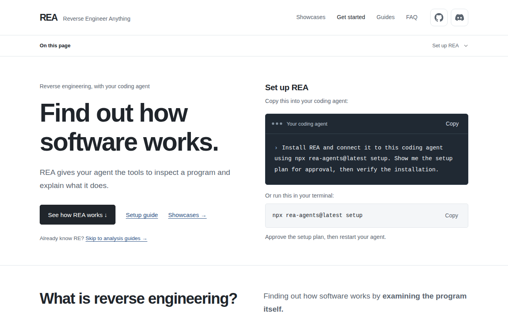

# REA (Reverse Engineer Anything) 완전 가이드 (초보자용)

> **한 줄 요약**
> REA는 AI 코딩 에이전트(Claude Code, Codex, Cursor 등)가 **소스 코드 없이 프로그램을 들여다보고 "이 기능이 어떻게 동작하는지"를 근거와 함께 설명**하게 해 주는 무료(MIT) **리버스 엔지니어링 도구 모음**입니다.
> 스킬 하나가 아니라 **MCP 서버 + 명령줄 도구(CLI) + 스킬**로 구성되어 있습니다. 설치는 한 줄입니다.
>
> ```powershell
> npx rea-agents@latest setup
> ```

- 공식 사이트: <https://rea.tools/> (가이드: `/guides/`, 사례: `/showcase/`)
- 공식 GitHub: <https://github.com/morluto/rea>
- npm 패키지: <https://www.npmjs.com/package/rea-agents> (패키지 이름은 **`rea-agents`**, 명령어 이름은 `rea`)
- 이 문서 기준 버전: **v6.1.0** (npm 최신, 2026-10-09 배포 / main 커밋 `cc39fc53`)
- 작성일: 2026-10-09

> ⚖️ **먼저 읽어 주세요: 합법적인 용도로만 쓰세요.**
> REA 공식 README의 면책 조항: "합법적인 리버스 엔지니어링 연구, 분석, 재구성을 위한 도구이며, 필요한 권한을 얻고 관련 법을 지키는 것은 사용자의 책임"입니다.
> - 분석하려는 프로그램의 **이용약관(EULA)** 이 리버스 엔지니어링을 금지하는지 확인하세요.
> - 나라마다 허용 범위가 다릅니다. 예를 들어 호환성 확보 목적의 코드 분석을 일부 허용하는 나라도 있지만 조건이 붙습니다. 업무나 상업 목적이면 법률 검토를 받으세요.
> - **내가 만든 프로그램, 분석을 허락받은 프로그램, 학습용 예제, CTF 문제**로 시작하는 것이 안전합니다.
> - 크랙(라이선스 우회), 악성코드 제작, 남의 서비스 공격에 쓰지 마세요.
> - REA 이름을 쓴 암호화폐·토큰은 프로젝트와 무관하다고 공식 README에 명시되어 있습니다.

---

## 목차

0. [이 문서를 어떻게 검증했나](#0-이-문서를-어떻게-검증했나)
1. [REA란 무엇인가](#1-rea란-무엇인가)
2. [무엇을 분석할 수 있나](#2-무엇을-분석할-수-있나)
3. [동작 원리와 구성요소](#3-동작-원리와-구성요소)
4. [설치 전 준비물 (Windows 사용자 필독)](#4-설치-전-준비물-windows-사용자-필독)
5. [설치하기](#5-설치하기)
6. [설치 확인](#6-설치-확인)
7. [사용법 1: AI에게 말로 시키기](#7-사용법-1-ai에게-말로-시키기)
8. [사용법 2: 명령어(CLI) 직접 쓰기](#8-사용법-2-명령어cli-직접-쓰기)
9. [따라 해 보기: 첫 번째 조사 (공식 튜토리얼)](#9-따라-해-보기-첫-번째-조사-공식-튜토리얼)
10. [응용: 대상별 실전 시나리오](#10-응용-대상별-실전-시나리오)
11. [응용: 네이티브 분석 엔진 연결 (Ghidra, Hopper, IDA)](#11-응용-네이티브-분석-엔진-연결-ghidra-hopper-ida)
12. [⚠️ 토큰 사용량 주의](#12-️-토큰-사용량-주의)
13. [업데이트하기](#13-업데이트하기)
14. [삭제하기](#14-삭제하기)
15. [문제 해결](#15-문제-해결)
16. [자주 묻는 질문](#16-자주-묻는-질문)
17. [출처](#17-출처)

---

## 0. 이 문서를 어떻게 검증했나

| 대상 | 확인 방법 | 결과 |
|---|---|---|
| 공식 사이트 rea.tools | curl, WebFetch, **chrome-devtools-mcp(Chromium)** 로 접속 시도 | ❌ 작업 환경의 네트워크 정책이 차단 (`ERR_TUNNEL_CONNECTION_FAILED`) |
| └ 대신 | 저장소의 `website/public` 폴더에 **사이트 원본 HTML이 그대로** 있어서, 로컬 서버로 띄워 chrome-devtools-mcp로 열고 캡처. 홈, 시작하기, 첫 조사, 가이드 3개(JavaScript, 브라우저, 네이티브), FAQ 본문을 모두 읽음 | ✅ (저장소 main 기준. 실제 배포 사이트와 약간 다를 수 있음) |
| └ Claude in Chrome | 이 클라우드 작업 세션에는 연결되어 있지 않아 사용 불가 | — |
| GitHub 저장소 | README(영어·한국어), `docs/installation.md`, `docs/cli.md`, `docs/windows-ghidra-p0.md`, 번들 스킬 `SKILL.md`, 소스 일부 확인 | ✅ |
| 실제 설치·실행 (v6.1.0) | 임시 홈 폴더에서 `setup` 계획 확인 → 적용 → `claude mcp list`로 **Connected** 확인 → `doctor` → `uninstall` | ✅ |
| 정적 JavaScript/Electron 분석 | 공식 예제(Notes Electron 앱)를 `analyze-javascript-application`으로 분석 → **사이트에 적힌 결과와 동일** (IPC 채널 1개, 처리기 1개, 짝 맞음) | ✅ |
| MCP 모드 | MCP 클라이언트로 도구 목록과 응답 크기 측정 (도구 138개, 프롬프트 6개) | ✅ |
| 네이티브 분석 (Ghidra/Hopper/IDA) | 이 환경에 해당 엔진이 없어 **직접 실행하지 못함**. 공식 문서 기준 | ⚠️ |
| Windows | 작업 환경이 Linux라 직접 시험하지 못함. 공식 문서 기준 | ⚠️ |



---

## 1. REA란 무엇인가

### 1.1 리버스 엔지니어링이란?

사이트의 설명을 그대로 옮기면 **"프로그램 자체를 살펴보며 소프트웨어가 어떻게 동작하는지 알아내는 것"** 입니다. 목표는 어떤 기능을 **설명하거나, 바꾸거나, 다시 만들 수 있을 만큼** 이해하는 것입니다.

**예시 (사이트의 계산기 사례):** "Windows 계산기에서 200 + 10%는 왜 220이 나올까?"
- **REA 없이:** 기계어(어셈블리)를 직접 읽으며 분기문 해석 → 함수 호출 추적 → 계산 규칙 복원. 전문 지식과 시간이 필요합니다.
- **REA와 함께:** AI에게 "REA로 Windows 계산기를 조사해서 200 + 10%가 왜 220인지 알려줘"라고 묻습니다. REA가 관련 명령어, 디컴파일된 코드, 호출 관계를 찾아 주고, AI가 그 근거로 "+ 다음의 %는 첫 숫자의 퍼센트(200의 10% = 20)를 계산한다"고 설명합니다.

### 1.2 REA의 특징

| 특징 | 설명 |
|---|---|
| **근거 제시** | 결론마다 근거(Evidence: 파일 위치, 주소, 명령어, 원본 바이트)와 한계(모르는 부분)를 함께 돌려줍니다 |
| **로컬 분석** | 분석은 내 PC에서 실행됩니다. 단, AI가 받은 결과는 AI 서비스(모델 제공자)로 전송되므로 그쪽 데이터 정책을 따릅니다 |
| **여러 종류의 대상** | 네이티브 실행 파일, JavaScript/Electron 앱, 웹사이트, .NET, Android APK, 펌웨어 등 (2장) |
| **두 가지 사용법** | AI 에이전트용 MCP 서버, 그리고 사람이 직접 쓰는 CLI |
| **기존 도구 활용** | 깊은 네이티브 분석은 Ghidra(무료), Hopper(유료·데모 있음), IDA(유료)를 엔진으로 사용합니다 |
| **인기** | 공식 README 기준 GitHub 스타 3만 개 이상. 관리자는 1인(morluto)이고, 업데이트가 매우 잦습니다 |

---

## 2. 무엇을 분석할 수 있나

공식 README의 표를 옮겼습니다. 오른쪽 열의 준비물이 있어야 해당 분석을 할 수 있습니다.

| 대상 | REA가 돌려주는 것 | 필요한 것 |
|---|---|---|
| **네이티브 실행 파일** (.exe, .dll, Mach-O, ELF) | 의사코드(pseudocode), 어셈블리, 문자열, 심볼, 호출과 참조 | **Hopper, Ghidra, IDA 중 하나** |
| **JavaScript / Electron 앱** | 모듈, import, 소스맵, 라우트, IPC, 네이티브 애드온 관계 | Node.js와 npm만 (**엔진 불필요, 가장 쉬움**) |
| **웹사이트** | 페이지 구조, 스크립트, 네트워크 관찰, 요청한 스크린샷 | Chrome 계열 브라우저 |
| 저장된 네트워크 기록 (HAR) | 요청, 응답, 노출된 데이터, 소스 위치 | HAR 파일 (Linux에서는 mitmproxy 기록도) |
| **.NET 어셈블리** | 메타데이터, CIL 명령어, 네이티브 의존성, 빌드 비교 | 정적 분석 (**엔진 불필요**) |
| Android APK | 매니페스트, 클래스, 디컴파일된 메서드, 참조 | JADX + JDK (Linux/macOS) |
| 펌웨어 | 영역, 추출 결과, 네이티브 분석 연결 | Binwalk / Unblob (Linux) |
| 패키지·리소스 | 파일 목록, 해시, plist, Apple 번들 구조 | — |
| 프로세스 동작 | 터미널 출력, 상호작용, 종료 상태, 파일 변경 관찰 | Linux/macOS |
| 오프라인 ELF 구조 | 섹션, 세그먼트, 심볼, 보호 기법 후보 | pwntools (Linux x64) |
| EVM 바이트코드 | 함수 선택자, 인자 추정 | 로컬 바이트코드 파일 |
| 기록된 Linux 크래시 | 스레드별 레지스터, 시그널 | pwntools, 선택적으로 GDB/pwndbg |

> 💡 **처음이라면** 엔진 설치가 필요 없는 **JavaScript/Electron 앱 분석**부터 시작하세요. 9장의 공식 튜토리얼이 바로 이것입니다.

정적 분석(JavaScript, .NET)은 파일을 **읽기만 하고 실행하지 않습니다.** 런타임 관찰(웹 페이지, 프로세스 등)은 **내 사용자 권한으로 대상을 실제로 실행하거나 조작**합니다.

---

## 3. 동작 원리와 구성요소

```
 ┌─────────┐ "이 앱에서 내보내기가    ┌─────────────────┐
 │ 사용자   │  어떻게 되는지 알려줘"  │ AI 에이전트       │
 └─────────┘ ───────────────────► │ (Claude Code 등) │ ← ① 스킬이 조사 절차를 안내
                                   └────────┬────────┘
                                ② MCP 도구 호출 (analyze_javascript_application 등)
                                            ▼
                                   ┌─────────────────┐
                                   │ REA MCP 서버      │ ← 내 PC에서 실행
                                   └────────┬────────┘
                         ③ 직접 분석하거나 엔진에 요청
                    ┌───────────────┼──────────────────┐
                    ▼               ▼                  ▼
            JS/Electron/.NET   Ghidra · Hopper · IDA   Chrome (CDP)
             (자체 분석)        (네이티브 분석 엔진)     (웹 관찰)
                                            │
                     ④ 결과 + 근거(Evidence) + 모르는 부분
                                            ▼
                         AI가 설명하고, 필요하면 비슷한 기능을 구현
```

| 구성요소 | 역할 | 설치 위치 |
|---|---|---|
| **MCP 서버** (`rea mcp`) | AI가 호출하는 분석 도구 **138개**와 프롬프트 6개 제공 (v6.1.0 실측) | `setup`이 각 AI 도구 설정에 등록 |
| **CLI** (`rea`) | 같은 분석을 터미널에서 실행 | `npx rea-agents` 또는 전역 설치 |
| **스킬** (`reverse-engineer-anything`) | AI에게 조사 절차를 안내하는 설명서. "대상 종류에 맞는 첫 도구 고르기", "근거와 모르는 부분 구분하기" 등 | `setup`이 `~/.agents/skills/`에 설치 (**Claude Code는 5.3절 참고**) |

**MCP 프롬프트 6개** (실측): `investigate_feature`(기능 조사), `compare_application_versions`(버전 비교), `verify_reconstruction`(재구성 검증), `trace_crash`(크래시 추적), `audit_residual_unknowns`(남은 미확인 항목 점검), `prepare_bounded_process_capture`(프로세스 관찰 준비)

---

## 4. 설치 전 준비물 (Windows 사용자 필독)

| 준비물 | 필수 여부 | 확인 |
|---|---|---|
| **Node.js** 22.x(22.19 이상), 24.x(24.11 이상), 또는 26 이상 | 필수 | `node --version` |
| npm | 필수 (Node.js에 포함) | `npm --version` |
| AI 코딩 에이전트 | AI와 함께 쓸 때 | `claude --version` |
| 네이티브 분석 엔진 | 실행 파일을 분석할 때만 | 11장 |

> ⚠️ **Node.js 23, 25, 시험판은 지원하지 않습니다** (공식 문서). REA는 Node.js나 npm을 대신 설치·업그레이드하지 않습니다.

### Windows에서 되는 것과 안 되는 것 (공식 문서 기준)

| 기능 | Windows |
|---|---|
| JavaScript/Electron 정적 분석 | ✅ |
| .NET 정적 분석 | ✅ |
| 웹사이트 관찰 (Chrome 연결) | ✅ (가이드는 Linux 예시지만 브라우저 실행 경로만 바꾸면 됨) |
| **Hopper** | ❌ Windows에서는 설치·사용 불가 (macOS, Linux 전용) |
| **Ghidra** | ⚠️ **실험적(P0)**: Windows 10 이상 x64, 로컬 NTFS 드라이브, x86/x64 PE 실행 파일(.exe, DLL 제외), **읽기 전용** 25개 기능만 |
| **IDA** | ✅ 공식 검증 환경이 Windows (IDA MCP 연결 필요) |
| Android, 펌웨어, 프로세스 관찰 | ❌ Linux/macOS 전용 |

---

## 5. 설치하기

### 5.1 가장 쉬운 방법: AI에게 맡기기 (공식 사이트 추천)

Claude Code(터미널 또는 데스크톱 앱 Code 탭)에 아래 문장을 그대로 붙여 넣습니다.
```
Install REA and connect it to this coding agent using npx rea-agents@latest setup. Show me the setup plan for approval, then verify the installation.
```
한국어로:
```
npx rea-agents@latest setup으로 REA를 설치하고 이 코딩 에이전트에 연결해줘. 적용 전에 설치 계획을 보여주고 내 승인을 받은 다음, 설치를 확인해줘.
```

### 5.2 직접 설치하기 (PowerShell)

```powershell
npx rea-agents@latest setup
```
진행 순서:
1. npm이 "패키지를 내려받아 실행할까?"라고 물으면 `y`. 이 승인은 **다운로드에만** 적용됩니다.
2. **설정할 AI 도구를 고릅니다** (여러 개 선택 가능). 이미 REA가 등록된 도구는 미리 선택되어 있고, 새로 발견된 도구는 선택되지 않은 상태로 나옵니다. Claude Code를 쓰면 **Claude Code**, 데스크톱 앱의 일반 채팅에서도 쓰려면 **Claude Desktop**도 선택하세요.
3. **설치 계획을 검토합니다.** 고칠 설정 파일 경로, 백업 경로, 스킬 설치 위치, 외부 프로그램 설치 여부가 표시됩니다.
4. 승인하면 적용됩니다. 기존 설정은 `.rea.backup`으로 백업되고, 관련 없는 설정은 그대로 둡니다.
5. **AI 도구를 재시작**합니다.

실제로 Claude Code를 선택했을 때의 계획 (임시 폴더에서 실측):

| 동작 | 대상 | 내용 |
|---|---|---|
| Claude Code 설정 | `~/.claude.json` | REA MCP 서버 등록. 백업: `~/.claude.json.rea.backup` |
| 스킬 설치 | `~/.agents/skills/reverse-engineer-anything` | 번들 스킬과 참고 문서 |

자동화용 옵션:
```powershell
npx rea-agents@latest setup --client claude_code --dry-run    # 계획만 보기 (아무것도 바꾸지 않음)
npx rea-agents@latest setup --client claude_code --yes        # 확인 없이 적용
npx rea-agents@latest setup --client claude_code --skill=false   # 스킬 없이 MCP만
```

지원 AI 도구와 `--client` 값:

| 도구 | 값 | 도구 | 값 |
|---|---|---|---|
| Claude Code | `claude_code` | OpenCode | `opencode` |
| Claude Desktop | `claude_desktop` | Antigravity | `antigravity` |
| Codex | `codex` | GitHub Copilot CLI | `copilot_cli` |
| Cursor | `cursor` | Command Code | `commandcode` |
| Gemini CLI | `gemini_cli` | VS Code | `vscode` |
| Windsurf | `windsurf` | Grok Build | `grok_build` |
| Devin | `devin` | | |

### 5.3 ⚠️ Claude Code 사용자: 스킬 위치 보완 (중요)

실측과 소스 확인 결과, `setup`은 스킬을 **`~/.agents/skills/`에만** 설치합니다. 그런데 Claude Code 공식 문서의 스킬 위치 목록(`~/.claude/skills/`, 프로젝트의 `.claude/skills/`, 플러그인 등)에는 **`~/.agents/skills/`가 없습니다.** 그래서 Claude Code에서는 **MCP 도구는 동작하지만 스킬(조사 절차 안내)은 로드되지 않을 수 있습니다** (추론, Claude Code에서 스킬 목록까지 직접 확인하지는 못함).

Claude Code용 위치에도 스킬을 넣으려면 (실측):
```powershell
npx skills add morluto/rea --skill reverse-engineer-anything -a claude-code -g
```
→ `~/.claude/skills/reverse-engineer-anything/`에 설치됩니다. Claude Code를 재시작한 뒤 `/` 입력 시 스킬 목록에 `reverse-engineer-anything`이 보이는지 확인하세요.

> 📌 이 방식은 GitHub main의 스킬을 받으므로, npm 릴리스보다 새로운 기능을 설명할 수 있습니다 (공식 문서 경고). 현재(v6.1.0)는 main과 npm 버전이 같습니다. AI는 실제 연결된 서버의 도구 목록을 기준으로 판단합니다.

### 5.4 다른 설치 방법

| 방법 | 명령 | 결과 |
|---|---|---|
| CLI 전역 설치 | `npm install --global rea-agents` 후 `rea --help` | 어디서나 `rea` 명령 사용 |
| 스킬만 설치 | `npx skills add morluto/rea --skill reverse-engineer-anything` | **설명서만** 설치. MCP 등록과 엔진은 없음 |
| MCP 수동 등록 | 아래 JSON | `setup`이 지원하지 않는 도구용 |
| curl 설치 스크립트 (macOS/Linux) | `curl -fsSL https://raw.githubusercontent.com/morluto/rea/main/install.sh \| bash` | 전역 npm 설치 후 `rea setup` 실행 |

MCP 수동 등록 (버전 고정 권장, 공식 문서):
```json
{
  "mcpServers": {
    "rea": {
      "command": "npx",
      "args": ["-y", "rea-agents@6.1.0", "mcp"]
    }
  }
}
```
Claude Code에 직접 등록하려면: `claude mcp add rea --scope user -- npx -y rea-agents@6.1.0 mcp` (일반적인 등록 형식이며, REA에서는 `setup` 사용을 권장)

> ⚠️ `npm install rea-agents`를 `--global` 없이 실행하면 현재 폴더의 `node_modules`에만 설치되어 `rea` 명령이 PATH에 잡히지 않습니다 (공식 문서).

---

## 6. 설치 확인

### 6.1 Claude Code에서 연결 확인 (실측)

```powershell
claude mcp list
```
```
rea: ... mcp - √ Connected
```
Claude Code 안에서는 `/mcp`로 확인할 수 있습니다. 데스크톱 앱 Code 탭도 같은 설정을 읽습니다 (Claude Code 공식 문서).

### 6.2 REA 진단 도구 `doctor` (읽기 전용, 아무것도 바꾸지 않음)

| 확인하고 싶은 것 | 명령 |
|---|---|
| Claude Code 등록 상태 | `npx -y rea-agents@latest doctor --client claude_code --json` |
| 설치된 스킬 | `npx -y rea-agents@latest doctor --skill --json` |
| Ghidra 엔진 | `npx -y rea-agents@latest doctor --provider ghidra --json` (`hopper`, `ida`도 가능) |
| 전체 점검 | `npx -y rea-agents@latest doctor --json` |

> 💡 전체 점검은 설치하지 않은 엔진까지 검사하므로 `healthy: false`가 나와도 내가 쓰려는 기능은 정상일 수 있습니다. **내가 쓸 부분만 골라서** 점검하세요.

### 6.3 AI로 확인

Claude Code를 재시작한 뒤:
```
REA 도구가 연결되어 있는지 확인하고, 쓸 수 있는 분석 종류를 알려줘
```

---

## 7. 사용법 1: AI에게 말로 시키기

**공식 사이트의 질문 요령:** **분석 대상의 경로(절대 경로)** 와 **조사할 기능 하나**를 구체적으로 주세요.

| 상황 | 이렇게 말하기 (공식 예시 기반) |
|---|---|
| Electron 앱의 기능 | "REA로 `D:/apps/example`을 분석해서 데이터를 어떻게 내보내는지 설명해줘. 관련 코드와 소스 위치도 보여줘." |
| 기능 이해 후 구현 | "REA로 노트 앱의 검색 기능이 어떻게 동작하는지 근거와 함께 알아보고, 내 프로젝트에 비슷한 기능을 만들어줘." |
| 네이티브 프로그램 | "REA로 `C:/games/dxball/DXBALL.EXE`에서 사운드 패닝을 어떻게 계산하는지 찾아서 계산식과 코드를 보여줘." |
| 웹사이트 동작 | "REA로 이 페이지를 관찰할 테니, 내가 Export 버튼을 누를 때 어떤 요청이 나가고 CSV를 어떻게 만드는지 알려줘. 디버깅 주소는 http://127.0.0.1:9222야." |
| 버전 비교 | "REA로 이 앱의 1.0과 1.1 버전을 비교해서 로그인 처리에서 바뀐 점을 찾아줘." |
| 이어서 질문 | "파일 쓰기에 실패하면 어떻게 되는지, 에러를 페이지까지 따라가 봐." |

**결과를 읽는 요령:**
- REA의 답에는 **근거(파일:줄, 주소, 명령어)** 와 **모르는 부분(unknowns)** 이 함께 옵니다. "모름"으로 표시된 부분을 다음 질문으로 삼으세요.
- AI가 근거 없이 단정하면 "그 결론의 근거 위치를 보여줘"라고 요청하세요.
- 공식 사이트도 **예측을 실제로 확인**하라고 권합니다 (9장 4단계).

---

## 8. 사용법 2: 명령어(CLI) 직접 쓰기

AI 없이도 같은 분석을 할 수 있습니다. 일회성으로는 `npx -y rea-agents@latest <명령>`, 전역 설치했다면 `rea <명령>`으로 씁니다.

### 8.1 자주 쓰는 명령

| 목적 | 명령 |
|---|---|
| 전체 명령 목록 | `rea --help` |
| JavaScript/Electron 앱 정적 분석 | `rea analyze-javascript-application <폴더 또는 .asar> --json` |
| 읽기 쉬운 JS 소스 복원 | `rea recover-javascript-sources ...` |
| 앱 개요 | `rea analyze <대상>` / `rea inspect <대상>` |
| 함수 하나 분석 (엔진 필요) | `rea function <실행파일> <함수이름 또는 주소> --provider ghidra --json` |
| 디컴파일 | `rea decompile ...` |
| 문자열·함수 이름 검색 | `rea search ...` |
| 참조 찾기 | `rea xrefs ...` |
| 기능 추적 | `rea trace ...` |
| 브라우저 탭 목록 | `rea list-browser-targets http://127.0.0.1:9222 --json` |
| 웹 페이지 관찰 | `rea inspect-web-page http://127.0.0.1:9222 <TARGET_ID> --observation-ms 10000 --json` |
| .NET 어셈블리 | `rea inspect-managed-artifact <파일>` |
| 압축·패키지 파일 | `rea inspect-artifact <파일>` / `rea extract-artifact ...` |
| 사용 가능한 엔진 | `rea providers --json` |
| 준비 상태 점검 | `rea doctor` |

각 명령의 정확한 입력은 `rea <명령> --help` 또는 `rea <명령> --schema`로 확인하세요.

### 8.2 출력 형식과 크기 조절 (중요)

| 옵션 | 효과 |
|---|---|
| `--format md` / `json` / `yaml` / `toon` / `jsonl` | 출력 형식 |
| `--filter-output <경로>` | 필요한 부분만 출력 (예: `normalized_result.summary`) |
| `--token-count` | 출력 대신 **토큰 수**만 표시 |
| `--token-limit <n>` / `--token-offset <n>` | 출력을 n토큰으로 자르기, 앞부분 건너뛰기 |

실측 예시 (6개 파일짜리 공식 예제):
```powershell
rea analyze-javascript-application D:/rea-example/notes-electron --token-count
# → 146778   (전체 출력이 약 14.7만 토큰!)

rea analyze-javascript-application D:/rea-example/notes-electron --filter-output normalized_result.summary --format md
# → 창 1개, preload 1개, 노출 API 1개, IPC 채널 1개, 처리기 1개 … (수백 토큰)
```
> ⚠️ **전체 결과를 AI에게 통째로 읽히지 마세요.** 12장을 꼭 보세요.

---

## 9. 따라 해 보기: 첫 번째 조사 (공식 튜토리얼)

공식 사이트의 "Your first investigation"을 따라 한 것입니다. 엔진 없이 Node.js만 있으면 됩니다.

**주제:** 작은 Electron 노트 앱에서 **"Export notes" 버튼을 누르면 파일이 어디에 저장되는가?**

### 1단계. REA 연결
5장대로 설치하고 Claude Code를 재시작합니다.

### 2단계. 질문하기
```
Download https://rea.tools/examples/notes-example.zip into a new example folder and unpack it. Use REA to find what happens when I click Export notes. Show where notes.csv is written, which fields it contains, and the relevant files and lines.
```
한국어로:
```
https://rea.tools/examples/notes-example.zip을 새 폴더에 내려받아 압축을 풀어줘. REA로 Export notes를 누르면 무슨 일이 일어나는지 찾아서, notes.csv가 어디에 저장되는지, 어떤 열이 들어가는지, 관련 파일과 줄 번호를 보여줘.
```
AI가 내려받지 못하면 직접 받아 압축을 풀고 폴더 경로를 알려 주세요.

### 3단계. 답 확인하기
기대하는 답 (공식 사이트):
> 버튼이 `notes:export` 메시지를 보냅니다. 메인 프로세스가 노트를 CSV로 만들어 **사용자의 다운로드 폴더에 `notes.csv`** 로 저장합니다. 열은 **id와 title**입니다.

흐름:
```
renderer.js (버튼 클릭) → notes.exportCsv()
   → preload.js: ipcRenderer.invoke("notes:export")   ← 프로세스 사이의 메시지(IPC)
   → main.js: ipcMain.handle("notes:export", ...)      ← 처리기
        → csv.js로 변환 → Downloads/notes.csv에 저장
```
REA 실측 결과 요약 (`normalized_result.summary.ipc`):
```json
{ "literal_channels": 1, "renderer_transmissions": 1, "main_handlers": 1,
  "paired_renderer_transmissions": 1, "ambiguous_renderer_transmissions": 0 }
```

### 4단계. 예측을 직접 확인하기
```
id가 1이고 제목이 Hello, "REA"인 노트를 CSV로 만들면 어떻게 될지 예측하고, 예제의 toCsv 함수를 Node.js로 실제 실행해서 예측과 결과를 비교해줘.
```
기대 결과 (쉼표가 든 제목은 따옴표로 감싸고, 따옴표는 두 번 씀):
```
id,title
1,"Hello, ""REA"""
```

### 5단계. 이어서 질문하기
```
파일을 쓸 수 없으면 어떻게 되는지, 에러를 화면까지 따라가 봐.
```

---

## 10. 응용: 대상별 실전 시나리오

### 10.1 JavaScript / Electron 앱 (엔진 불필요)

Electron 앱(Slack, VS Code, Notion 같은 데스크톱 앱)은 보통 `resources/app.asar` 파일에 JavaScript 코드가 들어 있습니다.
```
REA로 C:/Users/me/AppData/Local/Programs/SomeApp/resources/app.asar를 분석해서
설정 파일을 어디에 저장하는지, 관련 IPC 채널과 처리기를 소스 위치와 함께 보여줘.
```
- 공식 사례: **Notion의 클립보드 기능** 추적 (렌더러 → preload → IPC → 메인 프로세스)
- 채널 이름이 실행 중에 계산되는 경우는 정적 분석으로 풀리지 않을 수 있고, 그때는 "모름"으로 표시됩니다. 런타임 관찰로 보완합니다.

### 10.2 웹사이트 동작 관찰

공식 브라우저 가이드 기준입니다.
1. **별도 프로필**로 Chrome을 디버깅 포트와 함께 실행합니다 (Windows 예시).
   ```powershell
   & "C:\Program Files\Google\Chrome\Application\chrome.exe" --remote-debugging-port=9222 --user-data-dir="$env:TEMP\rea-browser" https://rea.tools/examples/notes-web/
   ```
2. AI에게 요청합니다.
   ```
   REA로 이 페이지를 관찰해줘. 디버깅 주소는 http://127.0.0.1:9222야.
   관찰을 시작했다고 하면 내가 Export notes를 누를게. 어떤 요청이 나가고 CSV를 어떻게 만드는지 알려줘.
   ```
3. 관찰 시작 후 버튼을 누릅니다. 결과: `GET notes.json → 200 → export.js가 CSV를 만들어 다운로드`

> 🚨 디버깅 포트가 열린 동안에는 내 PC의 어떤 프로그램이든 그 Chrome을 조종할 수 있습니다. **로그인된 평소 프로필을 쓰지 말고**, 끝나면 그 Chrome을 닫으세요.

### 10.3 네이티브 실행 파일 (엔진 필요, 11장)

공식 사례 **DX-Ball (고전 벽돌깨기 게임)**: 벽돌이 깨질 때 소리가 왼쪽·오른쪽 중 어디서 나는지 계산하는 함수를 복원했습니다.
- REA가 제공한 것: 함수의 명령어, 호출한 쪽(caller), 참조하는 상수 바이트(1.5625, 500.0 등)
- AI가 복원한 계산식: `pan = (x × 1.5625 − 500.0) × scale`
- 검증: 원본 x86 함수와 3,205개 입력으로 비교해 모두 일치, 컴파일된 63바이트도 동일하게 재현

질문 예:
```
REA로 C:/games/DXBALL.EXE에서 사운드 패닝 계산 방법을 찾아줘. 계산식과 코드를 보여주고,
복원한 C 코드가 원본과 같은지 확인할 방법도 제안해줘.
```
그 밖의 공식 사례: **TH04**(PC-98 도스 게임의 탄막 각도 계산 복원), **CTF** 문제 풀이, **Aegis** 로그인 코드 분석

### 10.4 .NET 프로그램 (엔진 불필요)

```
REA로 C:/tools/MyApp.exe(.NET)의 멤버 목록과 네이티브 DLL 호출(P/Invoke) 선언을 보여줘.
```

### 10.5 버전 비교

```
REA로 이 Electron 앱의 이전 버전(app-1.0.asar)과 새 버전(app-1.1.asar)을 비교해서
로그인 관련 코드에서 무엇이 바뀌었는지 근거와 함께 알려줘.
```
MCP 프롬프트 `compare_application_versions`가 이 작업용입니다. Claude Code에서는 MCP 프롬프트가 슬래시 명령(`/mcp__rea__compare_application_versions` 형태)으로 나타날 것으로 보입니다 (추론, 직접 확인하지 못함).

### 10.6 자기 코드 점검

내가 배포한 앱(빌드 결과물)에 **민감한 정보(API 키, 내부 주소)가 들어 있지 않은지** 확인하는 용도로도 쓸 수 있습니다.
```
REA로 내가 빌드한 dist/ 폴더를 분석해서, 번들에 API 키나 내부 서버 주소처럼 보이는 문자열이 포함되어 있는지 확인해줘.
```

---

## 11. 응용: 네이티브 분석 엔진 연결 (Ghidra, Hopper, IDA)

실행 파일(.exe 등)을 깊게 분석하려면 엔진 하나가 필요합니다. **REA는 Ghidra, Java, IDA를 설치해 주지 않습니다.** 직접 설치한 뒤 경로를 알려 줘야 합니다. Hopper만 `setup`이 (macOS/Linux에서, 승인 후) 설치할 수 있습니다.

| 엔진 | 가격 | 운영체제 | 비고 |
|---|---|---|---|
| **Ghidra** | 무료 (미국 NSA 공개) | Linux, macOS, **Windows(실험적)** | 12.1.x + 64비트 JDK 21 이상 필요 |
| **Hopper** | 유료 (데모 모드 있음, 기능 제한) | macOS, Linux | `setup`이 설치 제안 가능 |
| **IDA** | 유료 | Windows에서 검증 | 별도 IDA MCP 서버 등록 필요 |

### Windows + Ghidra 연결 (공식 문서 기준, 직접 시험하지 않음)

1. Ghidra 12.1.x와 64비트 JDK 21 이상을 직접 설치합니다 (압축 해제 경로 예: `C:\tools\ghidra_12.1.4_PUBLIC`).
2. PowerShell에서 경로를 지정하고 점검합니다.
   ```powershell
   $env:GHIDRA_INSTALL_DIR = "C:\tools\ghidra_12.1.4_PUBLIC"
   $env:JAVA_HOME = "C:\Program Files\Java\jdk-21"
   npx -y rea-agents@latest doctor --provider ghidra --json
   npx rea-agents@latest setup
   ```
   `setup`이 유효한 Ghidra/JDK 경로를 AI 도구 등록 정보에 기록합니다 (계획에 표시되고 승인 후 적용).
3. 터미널에서 함수 하나를 시험합니다.
   ```powershell
   npx -y rea-agents@latest function "C:/path/to/program.exe" main --provider ghidra --json
   ```

**Windows Ghidra의 제한 (실험적 P0):**
- Windows 10 이상 x64, **로컬 NTFS 드라이브**의 파일만
- **네이티브 x86/x64 PE 실행 파일**만 (DLL, .NET 관리 코드 제외)
- **읽기 전용** 분석 25가지만. 함수 이름 바꾸기·주석 같은 편집은 불가

**큰 실행 파일**은 Ghidra 시작 제한 시간을 늘리세요: 환경변수 `REA_GHIDRA_STARTUP_TIMEOUT_MS` (밀리초)

### 분석 세션 방식
- CLI는 명령마다 실행 파일을 불러와 분석하고 닫습니다.
- MCP(AI) 사용 시에는 열린 세션을 재사용하므로 연속 질문이 빠릅니다.
- REA는 Ghidra를 **임시 프로젝트, 읽기 전용**으로 실행하고, 내 기존 Ghidra 프로젝트를 열지 않습니다 (공식 문서).

---

## 12. ⚠️ 토큰 사용량 주의

이 장은 실측 결과입니다. **REA는 결과가 매우 큽니다.**

| 항목 | 실측 (v6.1.0) | 의미 |
|---|---|---|
| MCP 도구 수 | **138개** | |
| 도구 설명(입력 스키마)만 | 약 53만 자, **약 133,000토큰** (글자 수 ÷ 4 추정) | Claude Code는 **도구 검색이 기본으로 켜져 있어** 필요한 도구 설명만 불러옵니다 (Claude Code 공식 문서). 도구 검색을 끄면 대화 시작부터 매우 무거워집니다 |
| 6개 파일 예제를 MCP로 분석한 응답 | 약 118만 자, **약 295,000토큰** | Claude Code는 MCP 응답이 **1만 토큰을 넘으면 경고**하고, **기본 2만5천 토큰을 넘으면 파일로 저장**한 뒤 경로만 대화에 넣습니다 (공식 문서). AI가 그 파일에서 필요한 부분을 골라 읽어야 합니다 |
| 같은 예제의 CLI 전체 출력 | **약 146,778토큰** (`--token-count`) | 통째로 읽히면 컨텍스트를 크게 차지 |

**절약 방법:**
1. **질문을 좁게** 하세요. "앱 전체를 분석해줘" 대신 "Export 버튼에서 파일 저장까지만 따라가 줘"
2. CLI를 쓸 때는 **`--filter-output`** 이나 **`--token-limit`** 으로 필요한 부분만 뽑으세요.
3. AI에게 "결과 전체를 읽지 말고 요약(summary)과 관련 위치만 확인해줘"라고 지시하세요.
4. 쓰지 않을 때는 `/mcp`에서 rea 서버를 꺼 두세요. 이 가이드 저장소의 다른 도구(Chrome DevTools MCP 등)와 함께 켜 두면 부담이 커집니다.
5. 사용량은 `/context`(대화 컨텍스트)와 설정의 사용량 화면으로 확인하세요.

---

## 13. 업데이트하기

REA는 업데이트가 매우 잦고(공식 README: "버그 수정이 자주 포함된다"), **문제가 생기면 먼저 업데이트**하라고 권합니다.

| 설치 방식 | 업데이트 |
|---|---|
| `npx`로 setup한 경우 | `npx rea-agents@latest setup` 다시 실행 → 계획 검토 → 승인 → AI 재시작 |
| 전역 설치(`npm install --global`) | `rea update` → 출력된 setup 명령 실행 → AI 재시작 |
| 스킬을 `npx skills`로 추가한 경우 (5.3절) | `npx skills update -g` |
| 특정 버전으로 되돌리기 | `npm exec --yes --package=rea-agents@<버전> -- rea setup` |

> 💡 **등록은 버전이 고정됩니다.** `setup`은 AI 도구 설정에 "setup을 실행한 그 버전"을 적어 둡니다. 그래서 새 버전이 나와도 **setup을 다시 실행해야** AI가 새 버전을 씁니다. 실행 중인 서버는 재시작해야 바뀝니다.

현재 최신 버전 확인: `npm view rea-agents dist-tags.latest`

---

## 14. 삭제하기

### 14.1 REA 등록과 스킬 삭제 (실측)

```powershell
npx -y rea-agents@latest uninstall
# 전역 설치했다면: rea uninstall
```
실제 결과:
```
claude_code     removed   Removed registration from ~/.claude.json
(다른 AI 도구)   skipped   Configuration does not exist.
skill           removed   Removed ~/.agents/skills/reverse-engineer-anything
analysis_engine retained  Hopper is not owned by REA uninstall.
```

> ⚠️ **실측 주의: 터미널이 아닌 환경(AI가 대신 실행하는 경우 등)에서는 확인 질문 없이 바로 삭제됐습니다.** 그리고 감지된 **모든 AI 도구**에서 REA 등록을 지웁니다. 특정 도구에서만 지우고 싶다면 그 도구의 MCP 설정에서 직접 지우세요 (Claude Code: `claude mcp remove rea --scope user`).

**지워지지 않는 것** (공식 문서 + 실측):
- Hopper, Ghidra, IDA, Java, Node.js
- 분석 결과 파일(Evidence), 캡처 파일
- 다른 스킬과 다른 MCP 서버
- **5.3절에서 `npx skills`로 추가한 `~/.claude/skills/reverse-engineer-anything`** → 따로 지워야 함
- 설정 백업 파일 `~/.claude.json.rea.backup`

### 14.2 남은 것 정리

```powershell
# 5.3절에서 추가한 Claude Code용 스킬
npx skills remove -s reverse-engineer-anything -g -y

# REA 캐시와 상태 데이터(~/.rea)까지 지우기
npx -y rea-agents@latest uninstall --purge-data

# CLI 전역 설치 제거
npm uninstall --global rea-agents
```
- `--purge-data`는 `~/.rea` 아래의 REA 캐시·상태만 지웁니다 (공식 문서).
- `~/.claude.json.rea.backup`은 설치 전 설정의 백업입니다. 필요 없으면 직접 지우세요.
- Grok Bot에 수동으로 추가한 커넥터는 Grok Bot 채팅에서 직접 지워야 합니다.

---

## 15. 문제 해결

| 증상 | 해결 |
|---|---|
| **먼저 할 일** | **업데이트** (13장). 최신 버전에서 이미 고쳐졌을 수 있음 |
| AI가 REA 도구를 못 봄 | AI 도구 **재시작**. `doctor --client claude_code --json`으로 등록 확인. 등록이 없거나 오래됐으면 `setup --client claude_code` 다시 실행 |
| 등록은 정상인데 도구가 안 보임 | AI 도구의 MCP 연결 오류 확인 (`claude mcp list`, `/mcp`). `doctor`는 파일만 점검하고 실제 연결은 확인하지 못함 |
| Claude Code에서 스킬이 안 보임 | 5.3절 (`~/.claude/skills`에 추가 설치) |
| `rea` 명령을 찾을 수 없음 | `npm install --global rea-agents` 후 터미널 재시작, 또는 `npx -y rea-agents@latest <명령>` 사용 |
| Node.js 버전 오류 | 22.19 이상, 24.11 이상, 또는 26 이상으로 설치 (23, 25 불가) |
| 네이티브 분석이 안 됨 (`capability_unavailable`) | 엔진 미설정. `doctor --provider ghidra --json`으로 실패 항목 확인. 엔진이 여러 개면 `--provider`로 지정 |
| Ghidra가 큰 파일에서 시간 초과 | `REA_GHIDRA_STARTUP_TIMEOUT_MS` 늘리기 |
| Windows에서 Hopper 설치 안 됨 | 정상입니다 (Windows 미지원). Ghidra(실험적)나 IDA 사용 |
| 응답이 너무 길어 대화가 무거움 | 12장 |
| 그래도 안 되면 | GitHub 이슈에 REA 버전, 대상 종류, 재현 단계, 오류 출력 첨부. 커뮤니티: Discord |

---

## 16. 자주 묻는 질문

**Q. 무료인가요?**
A. REA는 MIT 라이선스 무료입니다. 엔진 중 Ghidra는 무료, Hopper와 IDA는 유료입니다 (Hopper는 기능이 제한된 데모가 있음). AI 서비스 토큰 비용은 별도입니다.

**Q. 리버스 엔지니어링을 몰라도 쓸 수 있나요?**
A. 공식 사이트가 그 점을 내세웁니다. 어셈블리를 읽을 줄 몰라도 AI에게 자연어로 묻고 근거와 함께 설명을 받을 수 있습니다. 다만 결과를 검증하는 습관(9장 4단계)이 중요합니다.

**Q. 내 프로그램이 외부로 업로드되나요?**
A. REA 자체는 로컬에서 분석합니다. 하지만 **AI가 받은 분석 결과는 AI 서비스로 전송**됩니다. 회사 기밀 프로그램이라면 회사 정책을 확인하세요.

**Q. Hopper, Ghidra, IDA가 꼭 필요한가요?**
A. 실행 파일을 깊게 분석할 때만 필요합니다. JavaScript/Electron, .NET 정적 분석은 엔진 없이 됩니다.

**Q. skills.sh에서 스킬만 설치하면 되나요?**
A. 아니요. 스킬은 설명서일 뿐이라 **MCP 서버 등록(`setup`)** 이 필요합니다. 반대로 Claude Code에서는 `setup`만으로는 스킬이 로드되지 않을 수 있어서 5.3절 보완을 권합니다.

**Q. 데스크톱 앱에서도 되나요?**
A. **Code 탭**은 Claude Code와 설정을 공유하므로 `setup`에서 Claude Code를 선택했다면 그대로 쓸 수 있습니다 (Local 세션). **일반 채팅(Chat 탭)** 에서 쓰려면 `setup`에서 **Claude Desktop**도 선택하세요.

**Q. 다른 도구(Chrome DevTools MCP, agent-browser)와 겹치나요?**
A. 웹사이트 관찰 기능이 일부 겹칩니다. REA는 **"이 기능이 코드상 어디서 어떻게 동작하나"를 근거와 함께 추적**하는 데 특화되어 있고, 다른 두 도구는 브라우저 조작·성능 분석이 중심입니다. 웹 페이지의 동작 원리를 파고들 때 REA, 화면 조작·테스트에는 agent-browser가 맞습니다.

---

## 17. 출처

- 공식 GitHub (1차 근거): <https://github.com/morluto/rea>
  - `README.md`, `README_ko.md`, `LICENSE`(MIT), `SECURITY.md`
  - `docs/installation.md`(설치, 지원 도구, 업데이트, 삭제), `docs/cli.md`, `docs/windows-ghidra-p0.md`, `docs/mcp-contracts.md`
  - `skill-src/reverse-engineer-anything/SKILL.md`
  - `src/application/SetupSkill.ts`, `Uninstall.ts` (스킬 설치 위치 `~/.agents/skills` 확인)
  - `website/public/` (rea.tools 사이트 원본: 홈, get-started, first-investigation, guides/javascript·browser·native, faq, showcase)
- 공식 사이트: <https://rea.tools/> (작업 환경에서 직접 접속은 차단됨. 위 원본으로 확인)
- npm: <https://www.npmjs.com/package/rea-agents> (`npm view`로 v6.1.0 확인)
- Claude Code 공식 문서
  - MCP 출력 한도와 도구 검색: <https://code.claude.com/docs/en/mcp>
  - 스킬 위치: <https://code.claude.com/docs/en/skills>
  - 데스크톱 앱 설정 공유: <https://code.claude.com/docs/en/desktop>
- 실측: rea-agents 6.1.0 CLI·MCP, Claude Code 2.1.x `claude mcp list`, skills CLI
